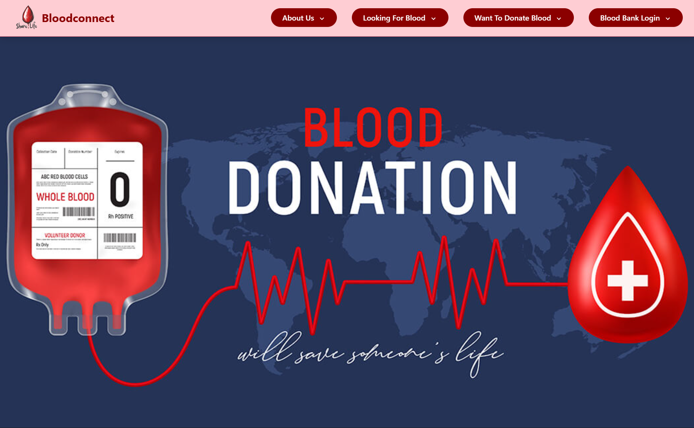
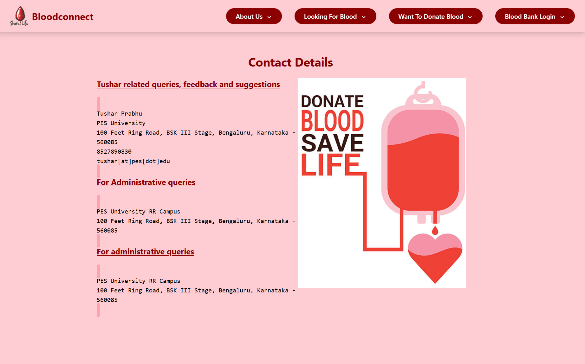
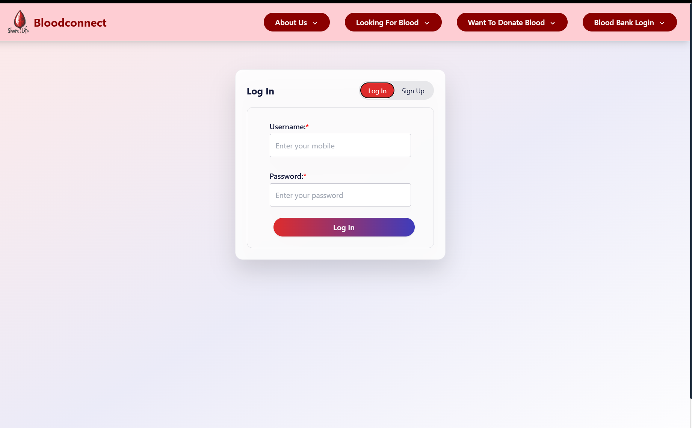
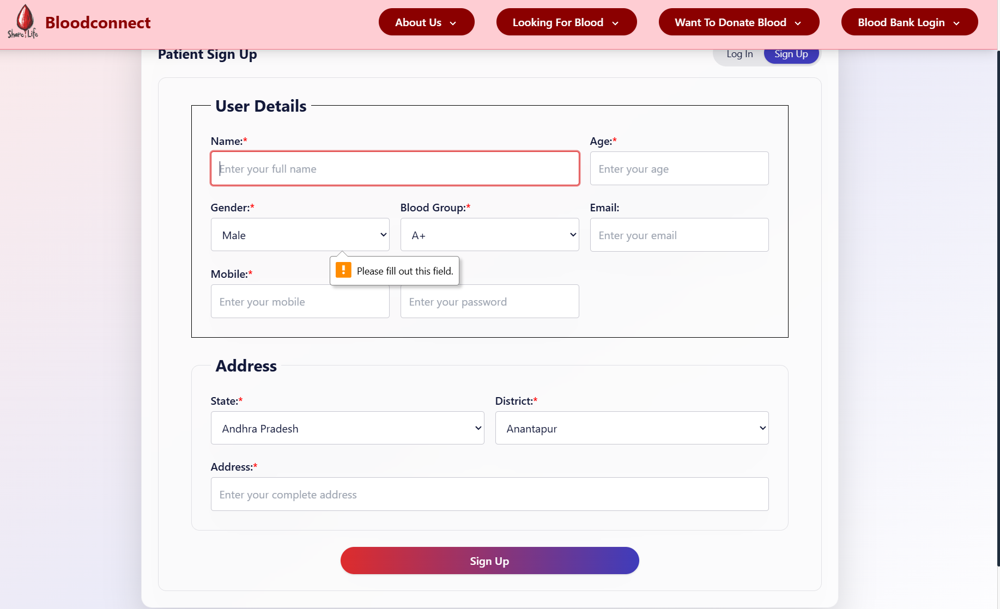
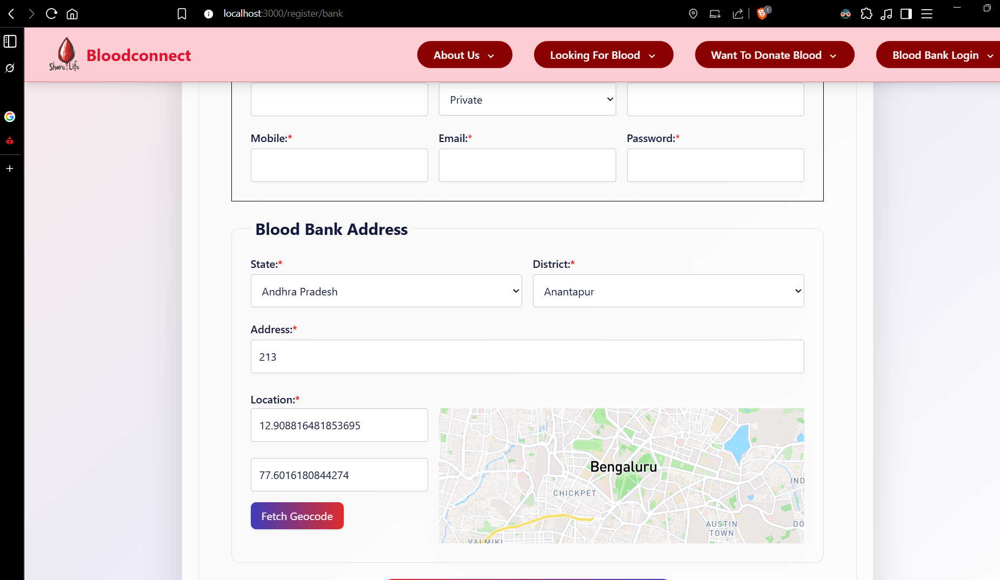
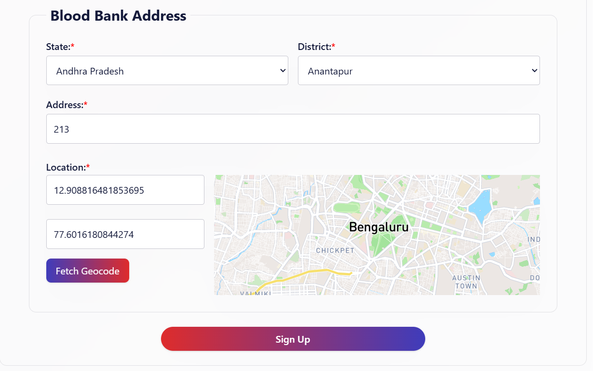
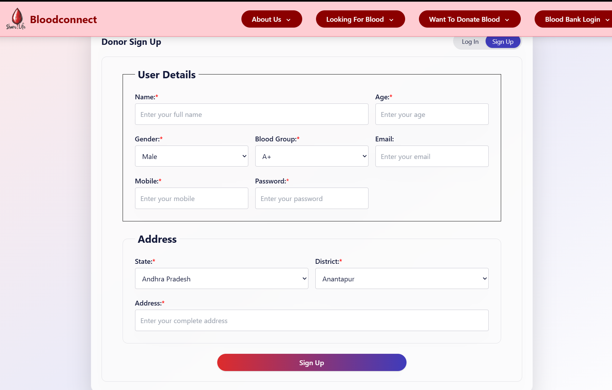
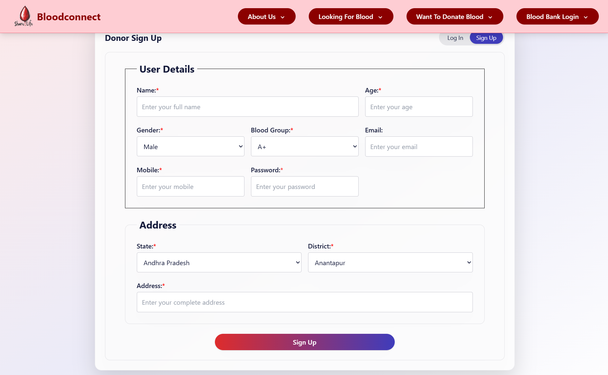

# Kalpana2024 – Blood Donation Management (Full‑Stack)

A full‑stack application to connect blood donors, blood banks, and the community. It provides user and bank portals, blood stock management, donation/request workflows, and blood donation camp management.

## What it is

A community-first platform that connects people who need blood with blood banks and donors, while making it simple to organize, discover, and participate in blood donation camps. It streamlines the journey—from a person requesting blood to a bank fulfilling it, and from a donor’s intent to a completed donation.

## Motive

- Save lives by reducing the time it takes to find and receive the right blood.
- Make donating blood easy, rewarding, and recurring.
- Help blood banks predict demand, avoid stockouts, and reduce wastage.
- Build trust and transparency across donors, recipients, banks, and organizers.

## Who it’s for

- People seeking blood (patients/caregivers) who need quick access and clarity.
- Donors who want convenient ways to contribute and track their impact.
- Blood banks and hospitals needing better visibility, workflows, and planning.
- Organizers/NGOs running donation camps and aiming for higher turnout and efficiency.
- Communities and authorities working toward emergency readiness.

## What it does

- For recipients: search nearby banks, view details, submit requests, and track status.
- For donors: discover camps, register in one click, and track donation history.
- For blood banks: manage stock, act on requests/donations, create/manage camps, confirm donor participation.
- For communities: centralized, transparent information that reduces friction and panic during crises.

## Outcomes

- Faster time‑to‑blood for patients.
- Higher donor retention and camp turnout.
- Fewer stockouts and lower wastage through better planning.
- Stronger trust via clear status tracking and accountability.

## Principles

- Accessibility: simple, focused flows for all users.
- Privacy & safety: sensitive actions protected without unnecessary friction.
- Inclusivity: regional awareness (states/districts) and community needs.
- Transparency: clear statuses and histories for requests, donations, and camps.

## Vision

- Real‑time availability and smart matching by location and urgency.
- Emergency alerts and rapid mobilization during disasters.
- Integrations with hospitals and public health systems.
- Multilingual and offline‑friendly experiences to reach everyone.

## Features

- User portal
	- Register/login, edit profile
	- Request blood and donate blood
	- Browse banks by state/district
	- Discover and register for blood donation camps
	- View history of requests and donations
- Blood bank portal
	- Manage bank profile
	- Manage stock by blood group (A+/−, B+/−, AB+/−, O+/−)
	- Review and update status of user requests and donations
	- Create/manage donation camps, confirm donor participation
- General
	- JWT auth via HTTP‑only cookies
	- Responsive UI with Tailwind CSS
	- REST API with MongoDB persistence

## Tech stack

- Frontend: React 18, React Router 6, Tailwind CSS
- Backend: Node.js, Express, Mongoose (MongoDB)
- Auth: JSON Web Tokens (JWT) via http‑only cookie
- Misc: Axios, CORS, dotenv, cookie‑parser

## Directory structure
```
Kalpana2024/
├─ backend/                 # Express API
│  ├─ app.js                # Server entry (port 3177)
│  ├─ models/models.js      # Mongoose schemas & models
│  ├─ routers/              # auth, user, bank, camp routers
│  ├─ middleware/auth.js    # JWT cookie auth middleware
│  ├─ package.json
│  └─ .env                  # Environment (not committed)
├─ client/                  # React app (CRA)
│  ├─ src/
│  │  ├─ App.js             # App routes & layout
│  │  ├─ Components/        # UI (User, Bank, Main, Auth, Util)
│  │  └─ assets/            # Images + data.json
│  ├─ public/
│  ├─ tailwind.config.js
│  └─ package.json
└─ ss/                      # Screenshots
```
\
## Contributing

1. Fork the repository
2. Create a feature branch: `git checkout -b feat/your-feature`
3. Commit with clear messages
4. Open a Pull Request describing changes and test steps


## More screenshots

<p>
	
	
</p>
<p>
	
	
</p>
<p>
	
	
</p>
<p>
	
	
</p>

